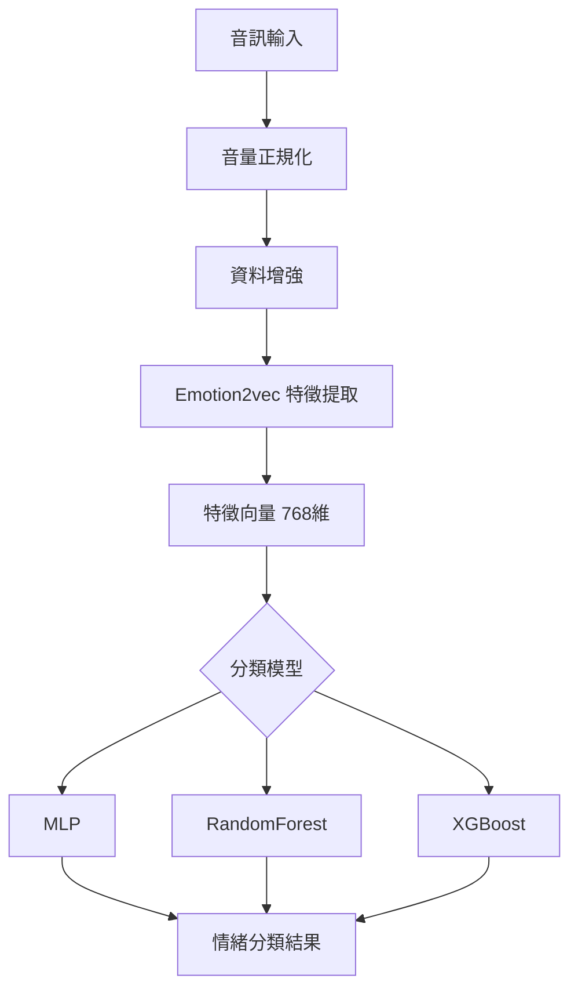
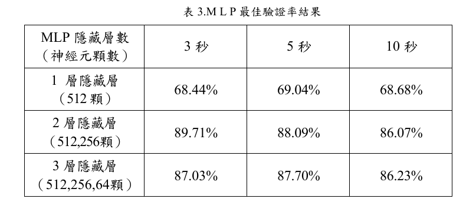

#  使用 Emotion2vec 及機器學習之語音情緒識別

本專案為元智大學電機工程學系畢業專題，  
目標為建立一套完整的語音情緒辨識系統（Speech Emotion Recognition, SER），  
透過 Emotion2vec 預訓練模型提取語音特徵，並搭配多種機器學習分類器進行情緒分類。

#### 最終模型在六種情緒分類中達到 90.04% 準確率
#### 並獲得畢業專題競賽優等獎
---

##  研究動機

語音情緒辨識在以下領域具有重要應用：

- 智慧語音助理
- 客服系統
- 心理健康分析
- 人機互動
- 醫療輔助系統

本研究希望建立一套具有良好泛化能力的語音情緒辨識流程，
並比較不同模型在特徵向量分類上的表現。

---

##  研究目標

- 建立完整語音情緒辨識訓練流程
- 使用 Emotion2vec 提取語音特徵
- 測試不同分類模型
- 研究資料增強對準確率影響
- 提升模型穩定性與泛化能力

---
##  系統流程

---
##  資料集

使用 Kaggle Voice Emotion Classification Dataset

情緒分類：

- Happy
- Sad
- Anger
- Fear
- Disgust
- Neutral

資料前處理：

- 音訊長度統一
- 音量標準化
- Padding / Trim
- 加入雜訊
- 音高變化
- Time Stretch
---

## 🤖 模型比較

| 模型 | 準確率 |        
|------|---------|
| MLP | 90.04% |
| XGBoost | 72% |
| RandomForest | 64% |

#### Optimizer： Adam
#### Scheduler： ReduceLROnPlateau
---

## 📈 實驗比較

#### 這張表格呈現了不同 MLP（多層感知機）架構在不同時間窗口下的驗證準確率比較

##  混淆矩陣

#### 最容易搞混的情況：
#### anger 常被誤判為 happy（193 筆）或 sad（79 筆）— 可能是因為憤怒與某些激動情緒在聲音或臉部特徵上有重疊
#### sad 常被誤判為 anger（142 筆）— 這兩個情緒在低激動度表情上容易混淆

#  未來改進方向
- 使用 CNN / LSTM 提取特徵
- 比較 wav2vec / hubert / AST
- 使用更大型語音資料集
- 即時語音情緒辨識系統
---
##  獎狀

##  論文
https://drive.google.com/file/d/1pgRWsxcVOi-7EDF73rE5FOvJ4ffI2ihX/view?usp=sharing
##  作者
李嘉諺、吳芸薰、李昱勳、邱靖琪 
元智大學 電機工程學系  
